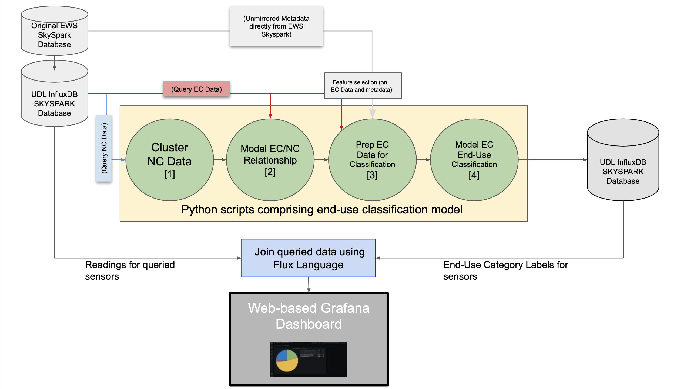

# Data 599 - Capstone

## File Directory
All code is found in the *code* folder with the main model being <code>main.py</code>

## Project Description
The UBC Urban Data Lab (UDL) was established to provide open access to sustainability data. UDL provides access to an InfluxDB time series database that contains data on instruments that record the power, energy, water, and gas use of each UBC building. Currently, many instruments have descriptive tags that are not understandable or are too granular for practical use by building managers. For that reason, the focus of the project is to apply machine learning techniques to classify and group instruments by energy end-use. This information will be useful for building managers to easily identify where energy efficiency improvements can be made.
The proposed project was to create a Python program that queries, cleans, and classifies each instrument that meters energy consumption - referred to as an Energy Consumption (EC) sensor in this project - by end-use type. While these EC sensors only make up a small percentage of the total instruments, data from the remaining instruments - referred to as Non-Energy Consumption (NC) sensors - was used to assist with the end-use classification task. The program queried EC and NC data from InfluxDB and the data was fed into a series of models. First, NC data was clustered into groups that reacted similarly. Next, the clustered NC data was used to model the EC/NC relationship. The purpose of modeling the relationship was to develop feature engineering for the EC end-use classification. Afterwards, the model coefficients, instrument metadata, aggregated EC data, and hand-labeled end-use training data were joined together. The final data set was fed into a classification model where EC sensors with unknown end-uses were classified. 
As seen in the Table 1 below, the classification model was able to predict and classify all 208 unknown energy consumption instruments into end-use categories.

Table 1: Number of Sensors per End-Use
| End-Use Label | Sensor Count | % of Sensors  | 
| ------------- | ------------- | ------------- |
|00_HEATING_SPACE_AND_WATER|54|26%|
|01_SPACE_COOLING|35|17%|
|02_HEATING_COOLING_COMBINED|39|19%|
|03_LIGHTING_NORMAL|26|13%|
|04_LIGHTING_EMERGENCY|10|5%|
|05_OTHER|44|21%|
|**Total**|**208**|**100%**|

The project achieved its goal by delivering a Python program that queries, cleans, and classifies instruments by end-use from live-streaming InfluxDB data for the Pharmacy building. The prediction accuracy of the program when applied to the testing dataset was 94.3%. The Python program assists with UDL’s vision of assisted Artificial Intelligence (AI) for proactive and preventive maintenance. A few recommendations for future work include increasing the size of the labeled training set and modifying code to work with the updated UDL database. 

## Project Approach

## Project Flowchart

